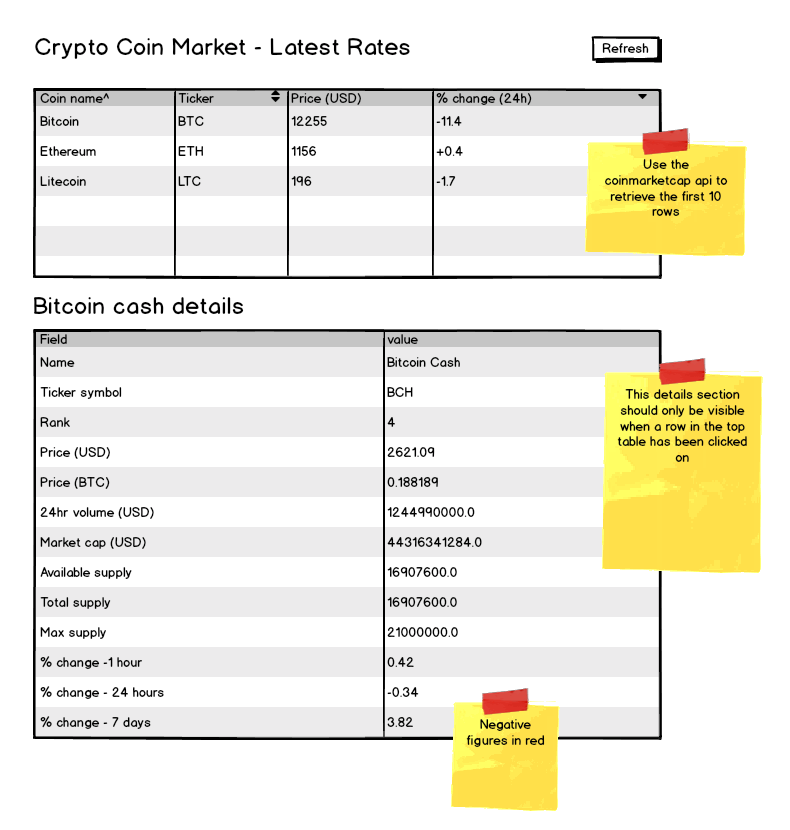

# Slim framework developer test repo

Please fork this repo to your own github account and proceed to build out your solution according to the requirements below. 

### Overview
The goal of this test is to build out a single page application capable of displaying the current exchange rates for a variety of cryptocurrencies. The requirements are relatively straightforward but please do ask for clarifications if required. 

 

### Core requirements
Within your fork of this repo, create a Slim Microframework v3 backed application with a javascript powered front end.

### The back end

Backend code should support and be able to run under PHP7+. No database server is required. 

This application should support 3 defined routes. 

* **/ (The home page)**: This will be the route that delivers the base html page for the application and is expected to contain the appropriate src tags for the javascript front end and any stylesheets. 

* **/api/rates/top10**: This route should be called from the front end on page load and whenever the 'Refresh' button is clicked. This route should make a call out to https://api.coinmarketcap.com/v1/ticker/?limit=10 using an appropriate http library such as GuzzleHttp. The payload for this route  will be the json payload as received from coinmarketcap (make sure that the Slim response instance is set to deliver the appropriate headers for a json response).

* **/api/rates/{id}**: This route should be called from the front end whenever the user clicks on a row in the upper table. This route should make a call out to https://api.coinmarketcap.com/v1/ticker/$id/ to retrieve the current info for the given crypto currency identified in the url. The json payload received from coinmarketcap should be returned to the front end as is. Again, make sure the Slim response instance is set to deliver the appropriate headers for a json response. 

### The front end
The javascript code for the front end can use any framework, library or simply be handwritten from scratch. The requirements are only that an XHR (Ajax) request to the backend be made on first page load for the top table of rates and be bound as event listeners to click events occuring on either a row in the top table or on the 'Refresh' button at the top of the page. 

### A measure of success
The application should work! Ideally simply by cloning your fork into a local folder, running any required build steps (e.g. composer install) and executing PHP's built-in web server in the appropriate directory. 

For bonus points, the following nice-to-haves will also be looked for

 * Neat, well structured, nicely fomatted code. 
 * Appropriate use of code comments / doc blocks
 * Appropriate use of the dependency injection container that ships with Slim.
 * An attractively laid out front end. Use of a css framework is encouraged but the choice is yours. Bootstrap? Material? Foundation? Hand rolled?

### Notes:
Please use Coinmarketcap.com's [json api](https://coinmarketcap.com/api/) to supply the data for your application. 

## Second Phase Developer Test

Please provide a solution to protect this application from network problems should coinmarketcap.com become unavailable. 

Ideally, this will include the ability to produce the last seen results as well as flag up a warning to the user that the quoted rates may be out of date. 

Your solution to this second phase test may be expressed either in code or as a design document describing the solution and how it would be implemented. 
